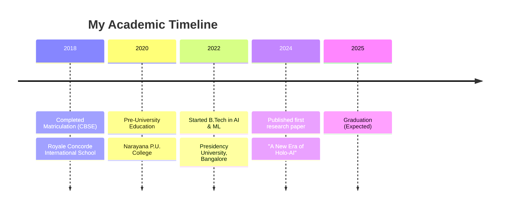

<h1 align="center">👋 Hey there, I'm Rayyan Khan</h1>
<div align="center">
  
[](https://git.io/typing-svg)

<p align="center">
  
</p>

</div>

<div align="center">
  
</div>

## 🧠 About Me 

> *"I am neither especially clever nor especially gifted. I am only very, very curious"*

I'm a tech enthusiast bridging the gap between cutting-edge AI research and practical applications. As the founder of **Holo-AI**, I'm pushing the boundaries of artificial intelligence while pursuing my B.Tech in AI & ML.

- 🚀 **Building the future** at Holo-AI, where holographic technology meets artificial intelligence
- 🤖 **Mastering LLMOps** - from fine-tuning foundation models to production deployment
- 🌐 **Crafting digital experiences** through full-stack development
- 🛸 **Exploring the skies** with advanced UAV & drone technologies
- 🔄 **Connecting the dots** between IoT, robotics, and cloud computing
- 🧪 **Experimenting daily** with emerging technologies and paradigms
- 🌱 **Growing constantly** through continuous learning and challenges
- 🤝 **Open to collaborate** on revolutionary projects that redefine possibilities

## 🎓 Education & Academic Journey



## 📚 Research Contributions

### 📌 A New Era of Holo-AI (2024)
Published in ICITEB Conference
- **Authors**: Rayyan Khan, Anmol Sharma, A. Raiyan Ahmed, Mohammed Rayaan Khan, Mohammed Mujahid Ulla Faiz
- **Focus**: Pioneering integration of AI with holographic technology
- **Impact**: Created a framework for holographic AI systems with practical applications
- **Real-world Applications**:
  - 🏥 Healthcare: 3D visualization of medical scans
  - 🎓 Education: Interactive holographic learning environments
  - 💼 Business: Next-generation presentation systems
  - 🎭 Entertainment: Immersive holographic experiences
  - 🔒 Security: Advanced surveillance and monitoring

## 💻 Tech Arsenal

<div align="center">

### 🌐 Languages


### 🧠 AI & ML Ecosystem


### 🌈 Web Development Stack


### ☁️ Cloud & DevOps Arsenal


### 🔧 Developer Tools


</div>

## 🏆 Certifications & Achievements

### 📜 Professional Certifications
- WgCapd Geoprocessing using Python (IIRS-ISRO)
- Fundamentals with Python (Global Core Tech)
- DSA in JAVA (CodeChef)
- CS50's Introduction to Programming with Python (Harvard University)
- CS50's Introduction to Artificial Intelligence with Python (Harvard University)
- Advanced Deep Learning Specialization (DeepLearning.AI)
- Google Cloud Professional Data Engineer
- AWS Certified Solutions Architect

### 🥇 Hackathon Glory
```
🏆 NATIONAL CHAMPIONS - Kodikon 3.0 by PES University
   └── Competed against 1500+ teams nationwide
   
🥈 RUNNER-UP - Smart India Hackathon by Presidency University
   └── Built scalable solution for real-world problem

🏅 TOP 3 - IIST Trivandrum Tech Fest Conscientia
   └── International recognition for innovation

🥉 4th PLACE - Smashhack Cybersecurity Hackathon
   └── Top 4 among 1400+ cybersecurity teams
   
🏆 TOP 10 - Hashcode 12.0 by The Innovation Lab PES University
   └── Advanced algorithmic problem solving

🏅 10th PLACE - Medicoure IIT Madras Research Park competition
   └── Healthcare innovation showcase

🎯 TOP 72 - Machine Hack subscriber prediction hackathon
   └── Advanced ML modeling competition
```

## 🚀 Pioneering Projects

<table>
  <tr>
    <td width="50%">
      <h3>🔍 AI Eye Gaze Detection System</h3>
      <p>An accessibility solution that transforms lives, allowing people with motor disabilities to control computers with eye movements alone.</p>
      <p><b>Tech:</b> Computer Vision, PyTorch, MediaPipe, OpenCV</p>
      <p><b>Impact:</b> Deployed for disabled individuals, border-force soldiers, and coding enthusiasts</p>
    </td>
    <td width="50%">
      <h3>🛒 Carpediem Luxury Marketplace</h3>
      <p>Exclusive digital marketplace showcasing premium Dubai-based luxury products with personalized AI recommendations.</p>
      <p><b>Tech:</b> Next.js, Node.js, MongoDB, AWS</p>
      <p><b>Impact:</b> Connecting luxury artisans with global customers</p>
    </td>
  </tr>
  <tr>
    <td width="50%">
      <h3>🚁 AI Embedded Autonomous Drone</h3>
      <p>Self-navigating drone system with advanced object recognition and path planning capabilities.</p>
      <p><b>Tech:</b> Raspberry Pi, TensorFlow Lite, ROS, Python</p>
      <p><b>Features:</b> Obstacle avoidance, mission planning, real-time telemetry</p>
    </td>
    <td width="50%">
      <h3>🤖 Humanoid Robot Project (Ongoing)</h3>
      <p>Next-generation humanoid with emotional intelligence and natural conversation abilities.</p>
      <p><b>Tech:</b> Jetson Nano, PyTorch, NLP, Sentiment Analysis</p>
      <p><b>Features:</b> Emotion recognition, conversational AI, gesture responses</p>
    </td>
  </tr>
</table>

## 🌍 Languages

```
English  ████████████████████████  Native
Hindi    ████████████████████████  Full Professional
Kannada  ████████████████████████  Full Professional
French   ██████████████░░░░░░░░░░  Limited Working
Arabic   ████████░░░░░░░░░░░░░░░░  Elementary
Spanish  ██████░░░░░░░░░░░░░░░░░░  Basic
```

## 🎯 Skill Proficiency

```
AI & Machine Learning   ███████████████████░░   90%
LLMOps                  ██████████████████░░░   85%
Full Stack Development  ███████████████░░░░░░   80%
Cloud Architecture      ██████████████░░░░░░░   75%
UAV & Drone Tech        ██████████████░░░░░░░   75%
IoT & Robotics          █████████████░░░░░░░░   70%
DevOps                  ████████████░░░░░░░░░   65%
Project Management      ███████████░░░░░░░░░░   60%
```

## 📊 Current Focus Areas
```
Building Holo-AI Platform     ███████████████████░░   90%
LLM Fine-tuning Research      ██████████████████░░░   85%
Drone Navigation Systems      ███████████████░░░░░░   80%
Full Stack Cloud Development  ████████████░░░░░░░░░   65%
```

## 🐍 GitHub Activity

<div align="center">
  
</div>

## 🔗 Connect with Me

<div align="center">
  <a href="https://github.com/Rayyankhan18">
    
  </a>
  <a href="https://linkedin.com/in/rayyankhan18">
    
  </a>
  <a href="https://twitter.com/rayyankhan18">
    
  </a>
  <a href="https://medium.com/@rayyankhan18">
    
  </a>
  <a href="https://dev.to/rayyankhan18">
    
  </a>
</div>

## 📈 GitHub Analytics

<table>
  <tr>
    <td colspan="2">
      
    </td>
  </tr>
  <tr>
    <td colspan="2">
      
    </td>
  </tr>
  <tr>
    <td>
      
    </td>
    <td>
      
    </td>
  </tr>
</table>

---

<div align="center">
  
  
  
  
  <p>👨‍💻 Crafting the future one commit at a time 👨‍💻</p>
</div>
